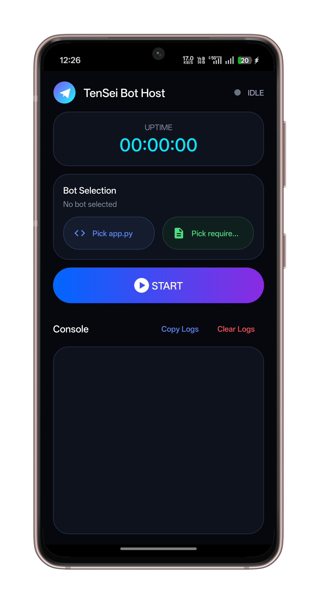

# TenSeiBotHost

<p align="center">
  
</p>

<h1 align="center">TenSeiBotHost</h1>

<p align="center">
  Android application for hosting and running Telegram bots directly on-device using an embedded Python runtime.
</p>

<p align="center">
  
  
  
  
  
</p>

---

## Overview

TenSeiBotHost is an Android host environment designed for executing Python-powered Telegram bots directly from an Android device without relying on external VPS infrastructure.

The application provides a portable runtime environment capable of running long-lived Telegram automation processes using Android foreground services and an embedded Python runtime.

---

## Core Features

- Embedded Python runtime
- Run Telegram bots directly on Android
- Foreground service execution
- Persistent background runtime
- Live runtime console logs
- Automatic startup handling
- Lightweight runtime environment
- APK-based deployment
- Minimal setup process
- Runtime dependency installation support

---

## Runtime Workflow

```text
Select app.py
        ↓
Select requirements.txt
        ↓
Press START
        ↓
Runtime initialization
        ↓
Dependency installation
        ↓
Bot execution begins
```

Once initialized, the bot continues running in the background through Android foreground services.

Runtime remains active until:

- device shutdown
- network disconnect
- force stop
- battery optimization termination

---

## Installation

### 1. Download APK

Download the latest release from the Releases section.

### 2. Install Application

Install the APK normally on your Android device.

### 3. Grant Permissions

Allow:
- Storage access
- Notification permission
- Background execution access

### 4. Disable Battery Optimization

Required for stable long-running background execution.

### 5. Configure Runtime

Select:
- `app.py`
- `requirements.txt`

Press `START`.

---

## Requirements

| Component | Requirement |
|---|---|
| Android Version | Android 8+ |
| Architecture | arm64-v8a |
| Internet | Required |
| Runtime | Embedded Python |
| Storage Access | Required |

---

## Runtime Notes

Some Android ROMs aggressively terminate foreground services.

Recommended configuration:

- Disable battery optimization
- Enable auto-start permission
- Lock the application in recents
- Avoid aggressive RAM cleaners

---

## Screenshots

<p align="center">
  
  
  
</p>

---

## Releases

Stable APK builds are available in the Releases section.

### Naming Format

```text
TenSeiBotHost-v1.0.apk
```

---

## Project Structure

```text
assets/python/
smali/com/tensei/bothost/
res/
AndroidManifest.xml
```

---

## Tech Stack

- Android
- Smali
- Embedded Python Runtime
- Foreground Services
- APKTool Workflow

---

## Status

Project is actively maintained and tested on Android arm64 devices.

---

## Disclaimer

This project is intended for development and educational purposes only.

Users are responsible for complying with local regulations and Telegram Terms of Service.

---

## License

MIT License
